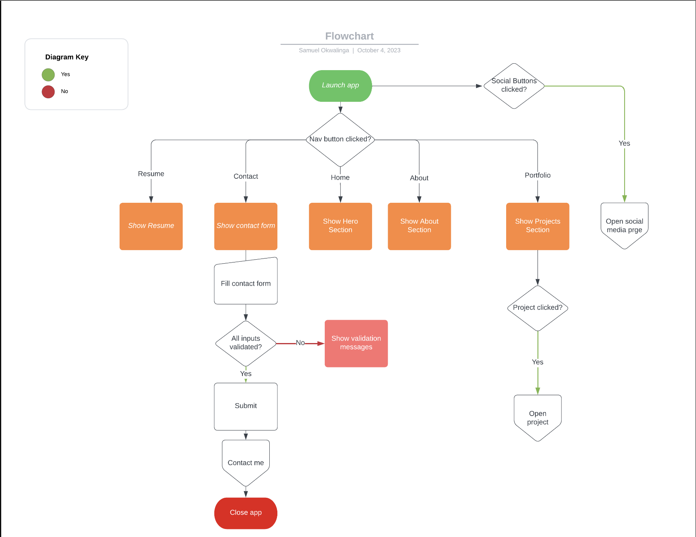
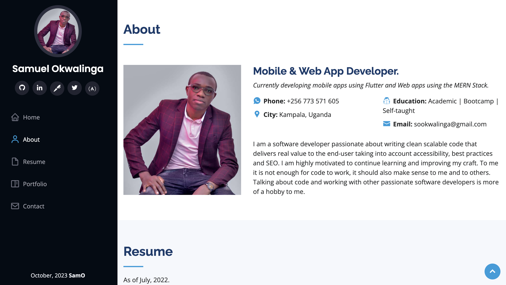

# Personal Portfolio Website Readme

## Project Overview:

Welcome to my Personal Portfolio Website! This project serves as an online showcase of my skills, projects, and experiences. Its primary purpose is to provide a platform where I can display my work, connect with potential collaborators, and demonstrate my abilities to prospective employers or clients.

### Goals:

The main goals of this project are:

- To present my portfolio in an organized and visually appealing manner.
- To highlight my skills and expertise in various domains.
- To share my past projects and experiences.
- To provide a means for users to get in touch with me for collaboration or inquiries.

## Features and Functionality:

### Key Features:

1. **Portfolio Showcase**: A collection of my projects and work, including descriptions, images, and links to project details.
2. **About Me**: A section where I introduce myself, share my background, and highlight my skills and interests.
3. **Contact Information**: Users can easily reach out to me through a contact form or find links to my social media profiles.
4. **Responsive Design**: The website is designed to work seamlessly on various devices and screen sizes.

### User Interaction:

- Users can explore my portfolio by clicking on project cards.
- They can contact me via the provided contact form or links to my social media profiles.
- The website offers a smooth and intuitive user experience with responsive design.

## Technologies Used:

This project is built using the following technologies and tools:

- **HTML**: For creating the website's structure and content.
- **CSS**: For styling and layout design.
- **JavaScript**: To add interactivity and dynamic behavior.
- **Flask**: For handling form submissions or dynamic content.
- **Netlify**: Where the website is deployed.

## Screenshots & Prototype:

[Protoype](https://www.figma.com/proto/eOX3A9H8y0Lz66hCt9l3td/Portfolio-Website?type=design&node-id=1-2&t=hnztp8W3zMAbr2vZ-1&scaling=scale-down&page-id=0%3A1&mode=design)

## Roadmap and Future Enhancements:

In the future, I plan to enhance this project by:

- Adding more projects to my portfolio as I complete them.
- Adding a blog section with informative articles in line with my interests.
- Enhancing performance optimizations for faster loading times.
- Integrating additional technologies or frameworks to improve functionality.

## Contact Information:

Feel free to connect with me or explore more of my work through the following channels:

- **Name**: Samuel Okwalinga
- **Email**: sookwalinga@gmail.com
- **GitHub**: [GitHub Profile](https://github.com/sookwalinga)
- **LinkedIn**: [Linkedin](https://www.linkedin.com/in/sookwalinga/)
- **Twitter**: [Twitter](https://twitter.com/sookwalinga)
- **Website**: [TO BE ADDED SOON!]

Thank you for visiting my Personal Portfolio Website!
